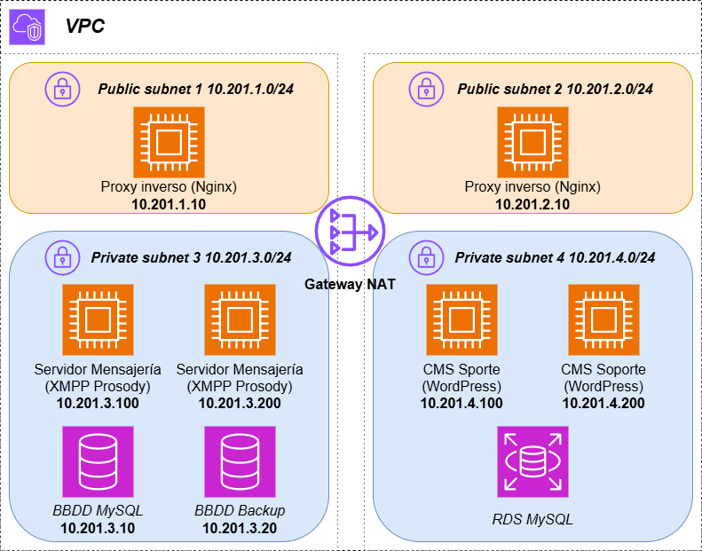

LA VPC TIENE QUE SER LA 10.2XX.0.0/16

# MensAGL 🔥 LosCowboysDelInfierno 🔥

Un servidor de comunicaciones unificadas que incluye mensajería instántanea, llamadas y videoconferencia.
Creado en AWS (Amazon Web Service) pensado para uso cotidiano y con la posibilidad de ser escalable.



## Introducción 📝
El sistema se compone de 4 redes en su totalidad, siendo 2 de ellas redes publicas para usar un proxy como balanceo de carga en las redes privadas.
En cada red privada se crean 2 instancias iguales, utilizando el proxy publico como balanceo de carga de solicitudes de los mismos y en cada red, utilizando diferentes tecnologias para la preservación de datos.
Hay tanto un sistema de mensajería como un sistema de resolución de incidencias.

El servicio de mensajería se compone de:
- Proxy publico con dominio dinámico (DDNS) `DuckDNS`. 🌐
- Clúster de mensajeria instantánea `XMPP Prosody`, llamadas y videoconferencia `Jitsi`. 💬 🔊
- Instancia EC2 `MySQL` para el servicio de mensajería, con otra instancia tipo NAS como copia de seguridad. 🏗️

El servicio de incidencias se compone de:
- Proxy publico con dominio dinámico (DDNS) `DuckDNS`. 🌐
- Clúster CMS `Wordpress` con sistema de tickets / resolución de incidencias. 👷
- Instancia `RDS MySQL` AWS como base de datos flexible para el clúster CMS. 🚩

## Instalación 🔧

### AWS CLI

1. Clona el repositorio ♻️

```bash
git clone https://github.com/cfuentesc01/mensagl-equipo2.git
cd mensagl-equipo2
```

2. Dentro de `aws scripts` ejecuta `installation.sh` 🧑‍💻

```bash
cd 'aws-cli'
chmod +x start.sh
./istart.sh
```
Tambíen existen otros scripts de AWS CLI para crear objetos en AWS de forma separada.

3. Responder a las cuestiones 📄

- `User` - Un nombre usado para añadir a las etiquetas de objetos, personalizando el esquema.
- `Email` - Correo electrónico para la gestión de cecrtificados y configuración de WordPress.
- `DuckDNS API` - Token proporcionado por DuckDNS en su página web.
- `dominios DuckDNS` - 2 Dominios DuckDNS a utlizar, tanto para el servico de mensajería como el de incidencias.
- `RDS Wordpress Database` - Nombre de la base de datos para el RDS Wordpress.
- `RDS Wordpress & XMPP Username` - Nombre de usuario para el RDS Wordpress.
- `RDS Wordpress & XMPP Password` - Contraseña para el usuario del RDS Wordpress. 

##  🚨 Still in development 🚧

